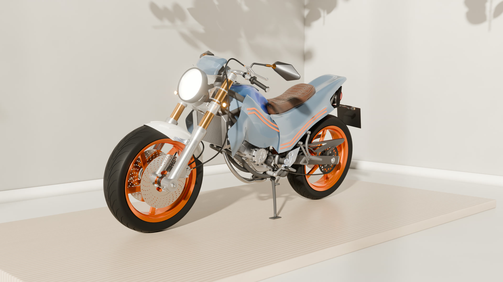
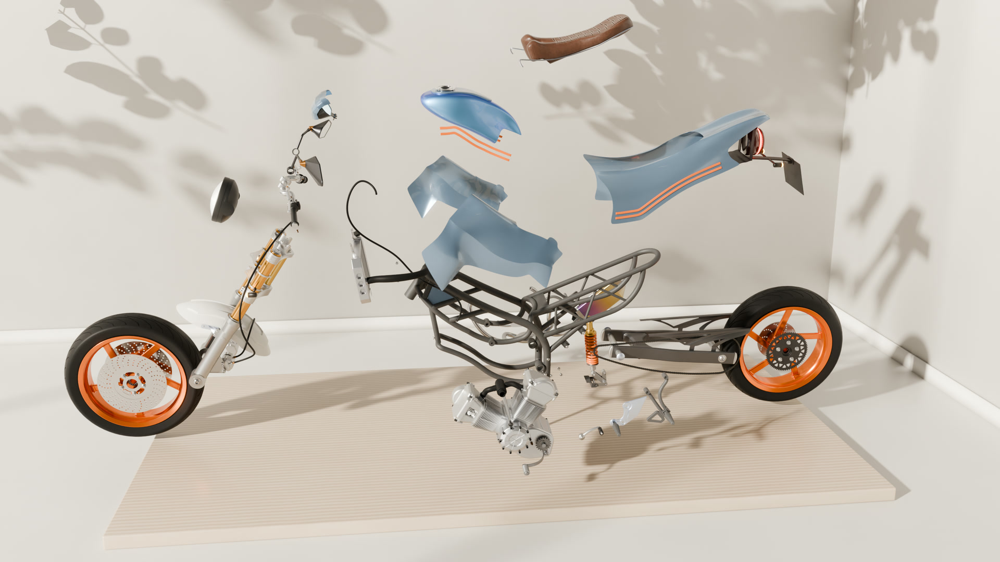
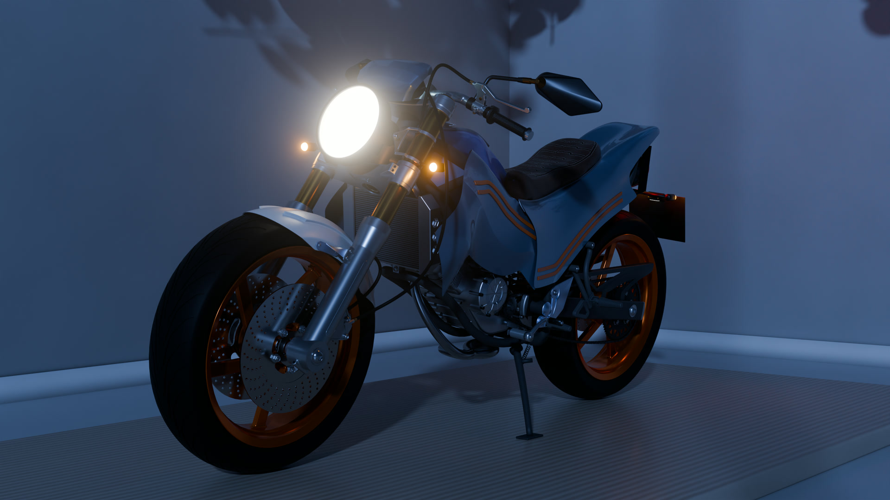
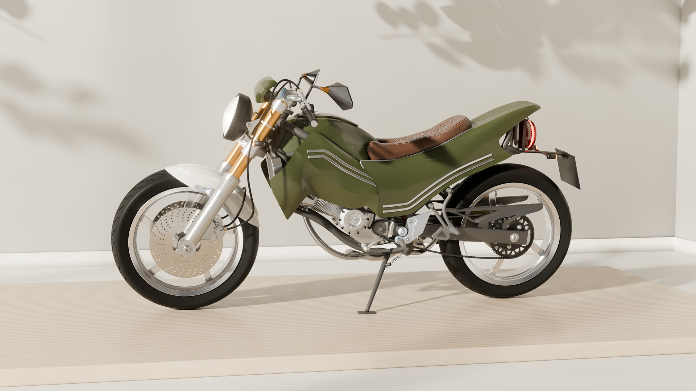
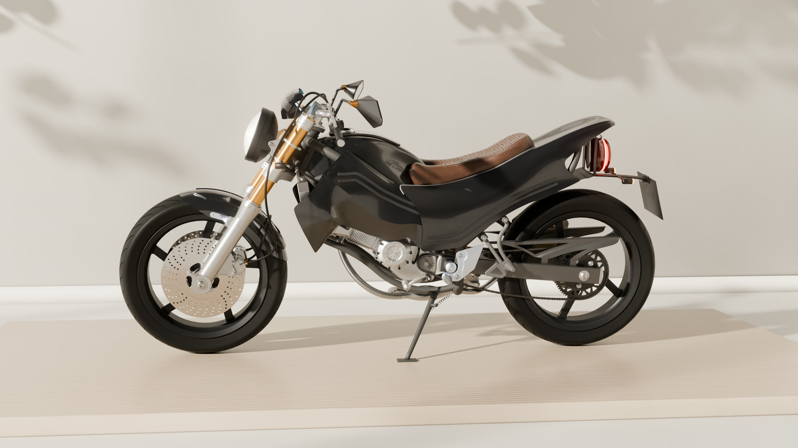

# Café Racer Concept

A complete motorcycle modelled part by part in SolidWorks, with my own bodywork and a frame I redesigned to pass structural analysis in ANSYS, then rendered and cut into a 70-second product film in Blender.

**[Watch the film (1080p, 23 MB)](media/film/cafe-racer-concept-1080p.mp4)** or on **[Watch on YouTube](https://www.youtube.com/watch?v=PtR7k8kXTPk)**

| | |
|---|---|
|  |  |
|  |  |

## What is in this repo

| Folder | Contents |
|---|---|
| [`cad/`](cad) | SolidWorks source: 217 parts, 41 assemblies and 42 drawings, grouped by subsystem (engine cases, clutch hub, shafts, transmission, wheels, brakes, suspension, lights, bodywork). The top-level assembly is `cad/Assembly/motocycle_assembly1.SLDASM`. |
| [`cad/assembly drawings/`](cad/assembly%20drawings) | Assembly drawings as SolidWorks drawings and PDFs. |
| [`simulation/`](simulation) | Geometry used for the frame and output-shaft FEA, and the stress animations exported from ANSYS Mechanical. |
| [`media/renders/`](media/renders) | Stills of the sub-assemblies: engine, engine head, clutch hub, crankshaft, wheels, shock absorber, hand brake, mirrors, speedometer. |
| [`media/animations/`](media/animations) | The full assembly sequence from SolidWorks and a cam-chain motion study. |
| [`scripts/solidworks/`](scripts/solidworks) | VBA macros that assign materials across the assembly and export every sub-assembly to glTF for Blender. |
| [`scripts/film/`](scripts/film) | Python scripts that check and merge render-farm frames, add the captions and end card in Blender, and build the soundtrack. |
| [`docs/`](docs) | Proposed drawing-number scheme for the project. |

## How it was made

1. **CAD.** Every part was modelled in SolidWorks 2026 and built up through sub-assemblies into one top-level assembly. The bodywork (tank, seat, side and rear panels) is my own design.
2. **Simulation.** The frame was analysed in ANSYS Mechanical and redesigned until it passed. The output shaft was analysed as well.
3. **Export.** A macro walks the assembly tree and exports each sub-assembly to glTF, so the Blender scene keeps the same structure as the CAD.
4. **Rendering.** Materials, lighting and animation were done in Blender 5.2 with Cycles. The 1,620 frames were rendered at 2560x1440 on a render farm.
5. **Edit and sound.** Captions and the end card are added by `scripts/film/make_edit.py`. The soundtrack (music edit, engine and synthesized effects) is built and mastered by `scripts/film/make_audio.py`.

## Opening the CAD

Open `cad/Assembly/motocycle_assembly1.SLDASM` in SolidWorks 2026 or later. Keep the folder structure as it is so the assembly can find its parts.

## Not included

The Blender scene files, the raw ANSYS result files and the glTF exports are left out because of their size. The glTF exports can be regenerated with `scripts/solidworks/motorcycle_export_gltf.bas`.

## Credits

- The project started from the part reference drawings in Christopher Rothera's Udemy course "PTC Creo Parametric - Full Motorbike Build", which I remodelled in SolidWorks. The course material itself is not in this repo.
- The bodywork is my own design, the frame was redesigned to pass structural analysis, and a number of other parts were modified along the way.
- Music: "Hard EDM" by kulakovka, from Pixabay.
- Studio lighting: `studio_small_09` HDRI from Poly Haven. Several materials are from BlenderKit.

## Author

Micheal Adediran, Mechanical Engineering student at the University of Lagos. More work at [mikedoesrobots.com](https://mikedoesrobots.com).
