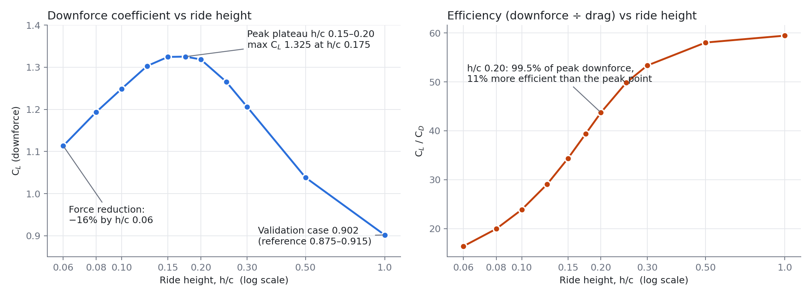
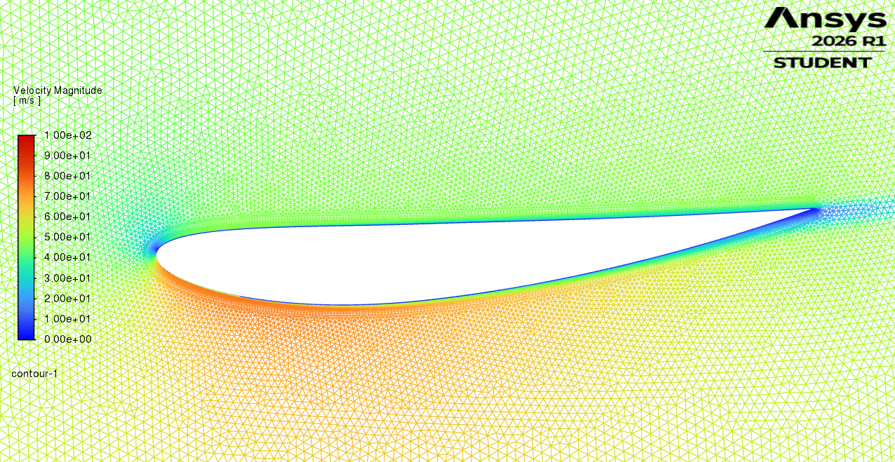
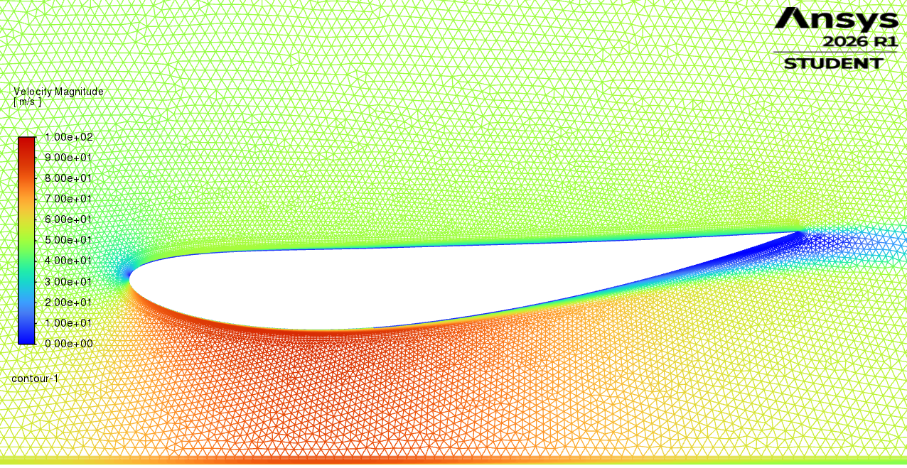
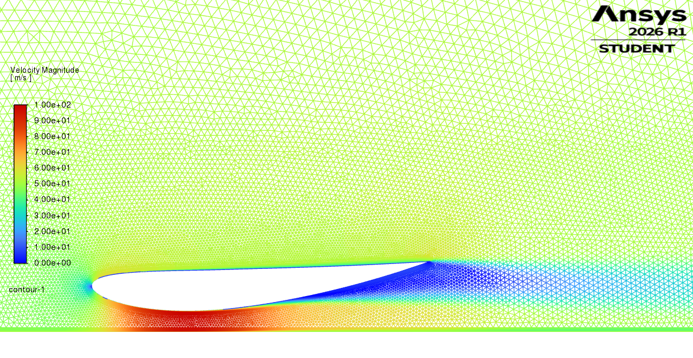

# Front wing in ground effect

A 2D CFD study of an inverted wing close to a moving road, run in ANSYS Fluent 2026 R1 (Student). It maps how downforce, drag and the flow change with ride height for a single wing element, and turns that into a ride-height recommendation.

This is a separate study from the café racer. The full write-up is at [mikedoesrobots.com/work/front-wing](https://mikedoesrobots.com/work/front-wing/).

## Set-up

| | |
|---|---|
| Wing | NACA 4412, inverted, chord 250 mm, 4° incidence |
| Flow | 50 m/s, Re = 8.6 × 10⁵, moving ground |
| Model | Steady RANS, k-ω SST, coupled solver, second order |
| Mesh | 107 000 to 148 000 cells, 25 prism layers, wall y+ ≤ 1.8 on the wing |
| Sweep | 11 ride heights from h/c 1.0 down to 0.06, residuals to 1e-5 |

At h/c 1.0 the model gives CL 0.902 and CD 0.0152, against reference values of 0.875 to 0.915 and 0.0135 from NeuralFoil at the same Reynolds number and incidence.

## Results

Final values from the Fluent report files in [`monitors/`](monitors). h/c is ride height divided by chord.

| h/c | Ride height (mm) | CL | CD | CL / CD | Report files |
|---|---|---|---|---|---|
| 1.00 | 250 | 0.902 | 0.0152 | 59.4 | `*-rfile.out` |
| 0.50 | 125 | 1.038 | 0.0179 | 58.0 | `*-rfile_1_1.out` |
| 0.30 | 75 | 1.206 | 0.0226 | 53.4 | `*-rfile_2_1.out` |
| 0.25 | 62.5 | 1.265 | 0.0254 | 49.9 | `*-rfile_8_1.out` |
| 0.20 | 50 | 1.318 | 0.0302 | 43.7 | `*-rfile_3_1.out` |
| 0.175 | 43.75 | 1.325 | 0.0337 | 39.4 | `*-rfile_9_1.out` |
| 0.15 | 37.5 | 1.325 | 0.0385 | 34.4 | `*-rfile_4_1.out` |
| 0.125 | 31.25 | 1.303 | 0.0448 | 29.1 | `*-rfile_10_1.out` |
| 0.10 | 25 | 1.249 | 0.0523 | 23.9 | `*-rfile_5_1.out` |
| 0.08 | 20 | 1.193 | 0.0598 | 19.9 | `*-rfile_6_1.out` |
| 0.06 | 15 | 1.113 | 0.0679 | 16.4 | `*-rfile_7_1.out` |

- Downforce rises 47% as the gap closes from 250 mm to 44 mm, then plateaus.
- Below that it falls: by 15 mm downforce is down 16% from the peak and drag is 4.5 times its value at 250 mm.
- **Recommendation: run the wing at 50 mm (h/c 0.20), not at the peak.** It makes 99.5% of maximum downforce with 11% better efficiency, and keeps margin before the wing drops onto the falling side of the curve.

| h/c 1.0 | h/c 0.20 | h/c 0.06 |
|---|---|---|
|  |  |  |

## What is in this folder

| Folder | Contents |
|---|---|
| [`geometry/`](geometry) | The inverted NACA 4412 coordinates, the wing-and-domain DXF for each ride height, and a Parasolid of the h/c 1.0 case. |
| [`cases/`](cases) | One Fluent case file per ride height (`hc<h/c>.cas.h5`), with the mesh and solver settings. |
| [`monitors/`](monitors) | Lift and drag coefficient histories written by Fluent for each run. |
| [`results/`](results) | The ride-height curve and its data as CSV, the mesh close-up, and velocity, pressure, wall-shear and y+ plots. |

## Not included

The Fluent data files (`.dat.h5`) and the standalone mesh files are left out because of their size. Opening a case file and running it reproduces the result.
